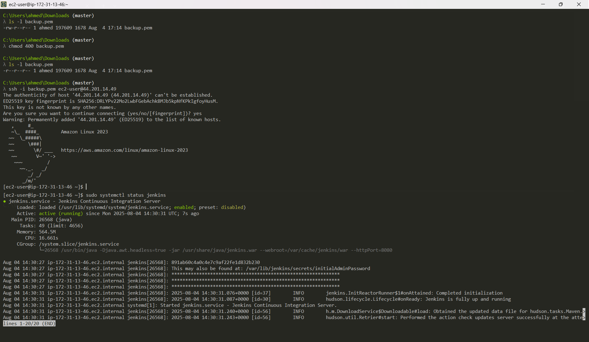
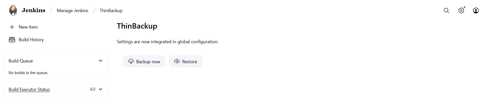
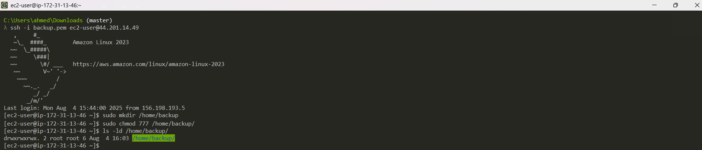
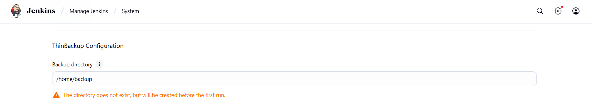
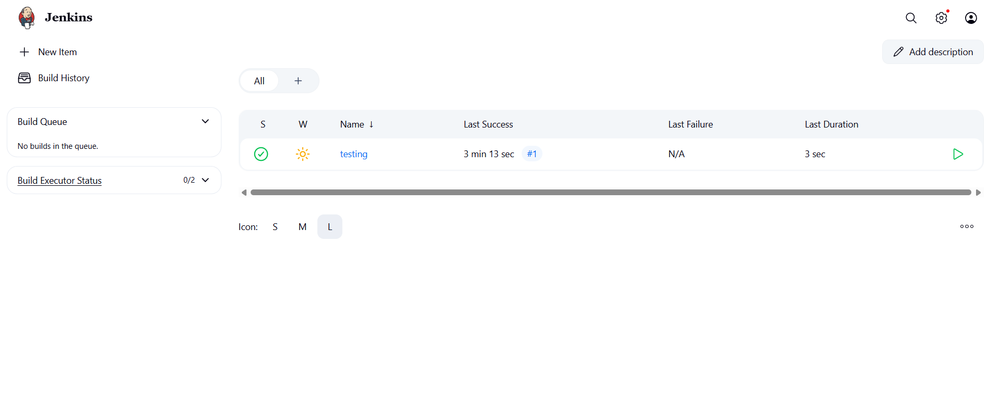
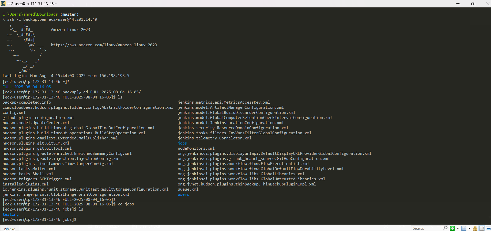
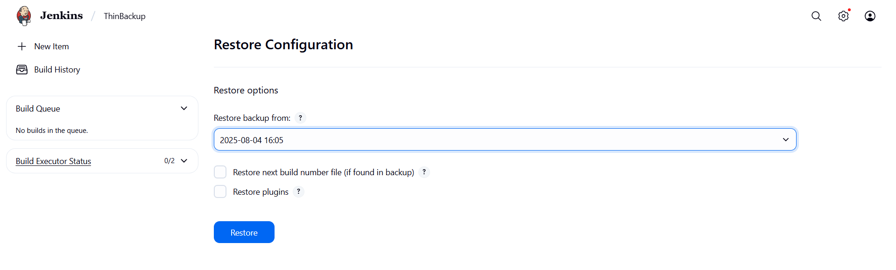
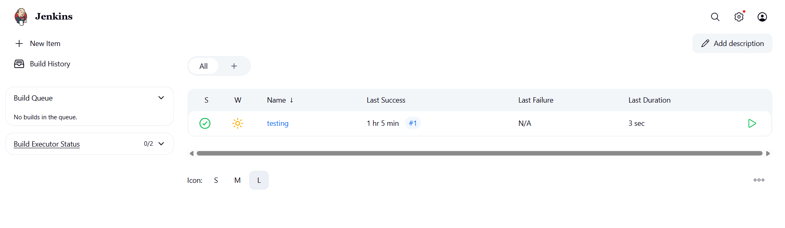

# 🚀 Jenkins Installation & Backup Guide

Welcome! This guide will help you install Jenkins, set up backups with the ThinBackup plugin, and restore your data with ease. Let's get started! 🎉

---

## 🏗️ Install Jenkins

- Follow the official tutorial: [Install Jenkins](https://www.jenkins.io/doc/tutorials/tutorial-for-installing-jenkins-on-AWS/#sidebar-content)



---

## 💾 Take Backup

### 1️⃣ Install ThinBackup Plugin

```bash
1) Install the "thinbackup" plugin from Jenkins Plugin Manager.
```

### 2️⃣ Prepare Backup Directory

```bash
2) Create a backup directory:
   sudo mkdir /home/backup

3) Change permissions to make it writable:
   sudo chmod 777 /home/backup
```

### 3️⃣ Configure Backup Path

- Add `/home/backup` as the backup location in:
  - Set the path under **Manage Jenkins** → **Configure System** → **ThinBackup section**





---

## 🛠️ Create a Simple Pipeline

- Create a pipeline job in Jenkins (e.g., "Simple Pipeline") so you can test backup and restore.

```bash
Create a 'Simple Pipeline' to restore it after deleting it.
```



---

## 🗄️ Create Backup

- In Jenkins, go to **Manage Jenkins** → **ThinBackup** → **Backup Now** and click the button.

```bash
After clicking "Backup Now", your Jenkins data will be backed up to the configured path.
```




---

## ♻️ Restore Data

- If you delete your "Simple Pipeline" or any other data, you can restore it:

```bash
1) Go to Manage Jenkins → ThinBackup → Restore.
2) Select the backup version you want to restore.
3) Click "Restore".
4) Restart Jenkins to see the restored data.
```





---

## 📚 Summary

- ✅ Jenkins installed
- ✅ ThinBackup plugin configured
- ✅ Automated backups setup
- ✅ Restore process verified

---

> 🔒 **Tip:** Regularly verify your backups and store them securely!

Happy Jenkins-ing! 🎈