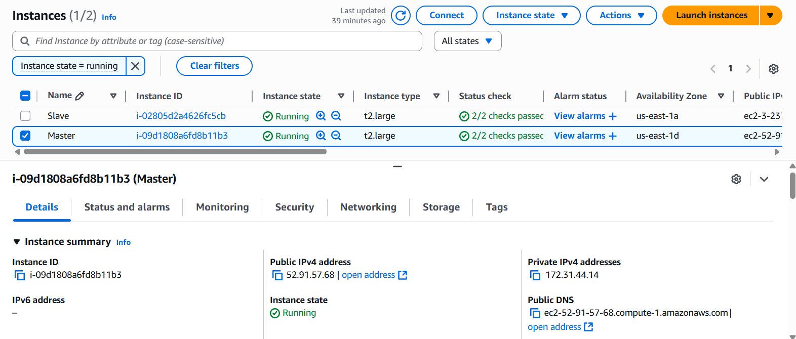
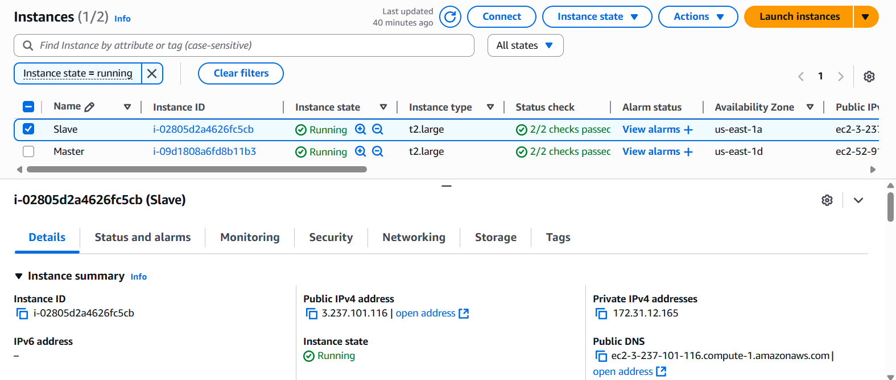
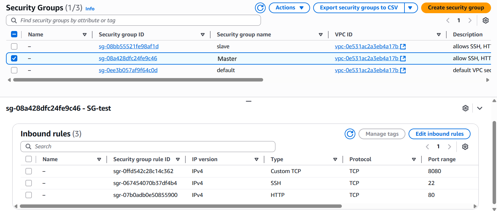
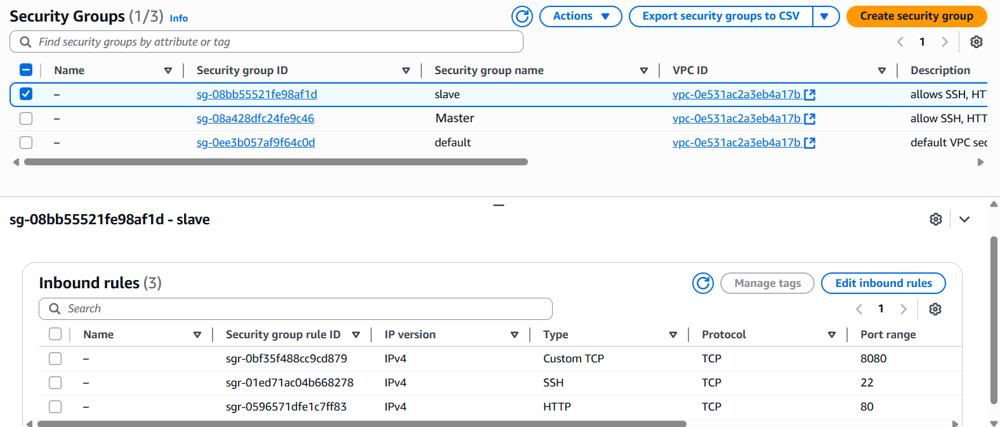
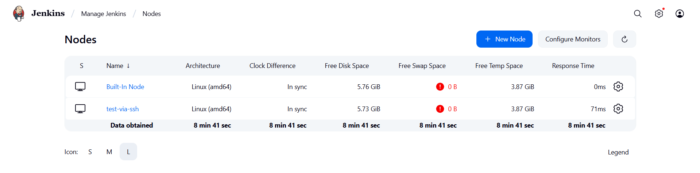
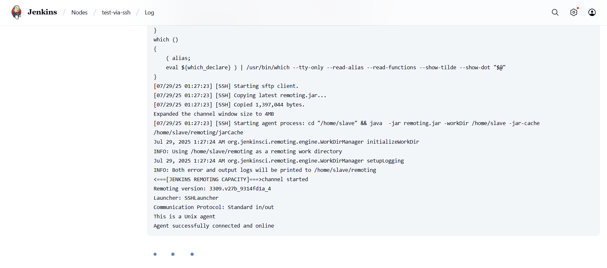
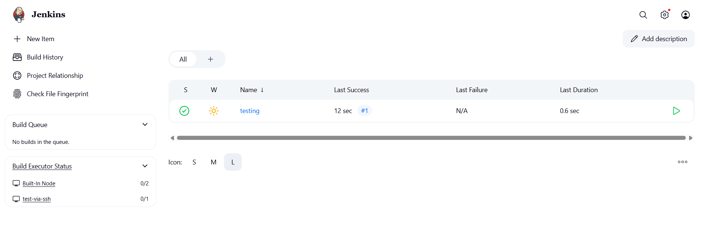
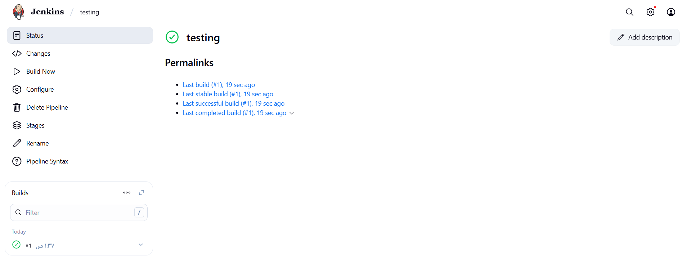
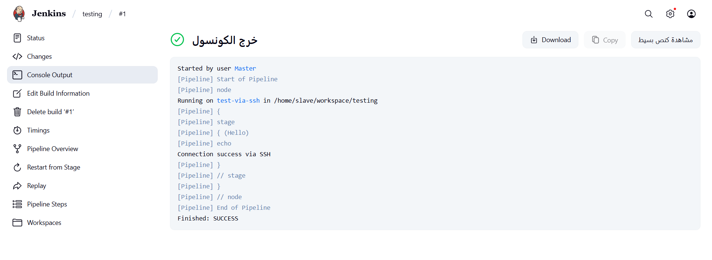

# 🚀 Build Agent Setup Guide

Welcome! This guide will walk you through setting up Jenkins on two AWS EC2 instances to create a **controller-agent architecture** for your builds. 🖥️⚡

---

## 1️⃣ Install Jenkins on Two EC2 Instances

Follow the official Jenkins tutorial for installing on AWS:

👉 [Jenkins AWS Installation Guide](https://www.jenkins.io/doc/tutorials/tutorial-for-installing-jenkins-on-AWS/#creating-a-key-pair)

---

## 2️⃣ Create & Connect to EC2 Instances

```bash
# Set permissions for your private key
chmod 400 private.pem
ls -l private.pem  # Should show read-only permission

# Connect to the instance via SSH
ssh -i private.pem ec2-user@<Public-IP>
```




---

## 3️⃣ Configure Security Groups (SGs)

Open the following ports on both instances’ security groups:

- 🟢 **SSH (22)**
- 🌐 **HTTP (80)**
- ⚙️ **Jenkins (8080)**




---

## 4️⃣ Configure the Jenkins Agent (Node)

### 🧑‍💻 4.1 Create a User on the Agent Instance

```bash
# SSH into the Agent instance
ssh -i privatekey.pem ec2-user@<Agent-Public-IP>

# Add a user for Jenkins
sudo adduser slave     
tail -n 3 /etc/passwd   # Verify user creation
groups                  # Check current groups

# Give 'slave' root privileges
sudo usermod -aG wheel slave
groups slave            # Verify group membership

# Set a password for the new user
sudo passwd slave
```

✨ **Ensure the following in `/etc/ssh/sshd_config`:**
```bash
PermitRootLogin no
PasswordAuthentication yes
```
Then restart SSH:
```bash
sudo systemctl restart sshd
```

#### 🔗 Test SSH Connection from Controller to Agent

```bash
# Controller -- Master
# Agent -- Slave
ssh slave@<AGENT_PUBLIC_IP>
```

---

### ⚙️ 4.2 Create a Jenkins Node (Agent) in Jenkins UI

1. Go to **Manage Jenkins** ➡️ **Nodes** ➡️ **New Node**
2. Fill in:
   - **Name:** `slave`
   - **Type:** Permanent Agent
   - **Number of executors:** `1`
   - **Remote root directory:** `/home/slave`
   - **Labels:** `slave`
   - **Usage:** Only build jobs with label expressions matching this node (or use as much as possible)
   - **Launch method:** Launch agents via **SSH** 📌
   - **Availability:** Keep this agent online as much as possible
3. **Save**

⏳ After saving, the controller will attempt to SSH into the agent and download `agent.jar`.

---

### 🟢 Bring the Agent Online

1. If the status is **Offline**:
   - Click the node name in Jenkins
   - Return to the agent’s CLI:
     - `cd /home`
     - Copy the Unix launch command from the Jenkins UI on the controller and run it on the agent

> 💡 *If the resources are insufficient, the node will remain offline.*




---

## 🧪 Test the Connection

1. Create a new item (**Pipeline**) in Jenkins.
2. Under **Definition**, choose **Pipeline script**.
3. Paste and save the following:

```groovy
pipeline {
    agent {
        label 'slave'
    }
    stages {
        stage('Hello') {
            steps {
                echo 'Connection success via SSH'
            }
        }
    }
}
```

---

## 📊 Output





---

## 📝 Notes

###  Launch agents via 'SSH' 🟡🔵

**Description:** 
 
The **Controller** (Jenkins Master) establishes an SSH connection to the **Agent** and runs the Java agent process.

**How it works:**
- The Controller must know the IP address or hostname of the Agent.
- Prepare SSH credentials (username + password or key).
- Port **22** must be open on the Agent to receive connections.
- The Controller sends the Jenkins `agent.jar` to the Agent and executes it.

**When to use this method:**
- When you have full access to the Agents and can SSH into them.
- When the network allows inbound connections from the Controller to the Agent.
- This approach is ideal when all servers are in the same VPC or a secure internal network.V

---

## 🎉 You're All Set!

Your Jenkins master-agent setup is now ready to build and deploy projects efficiently! 🚦

---