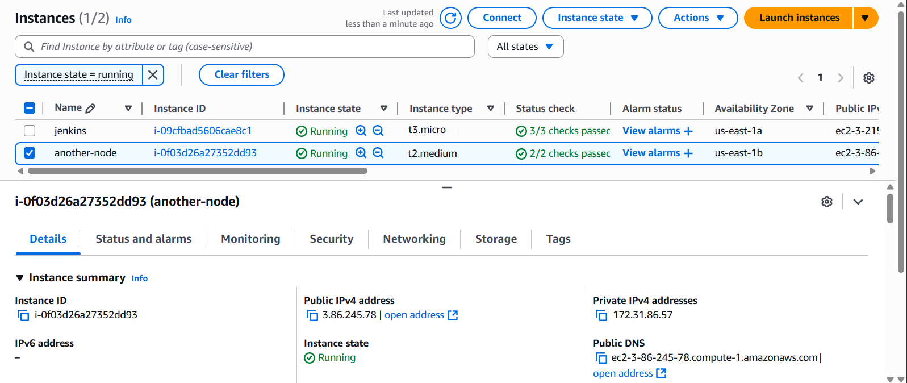
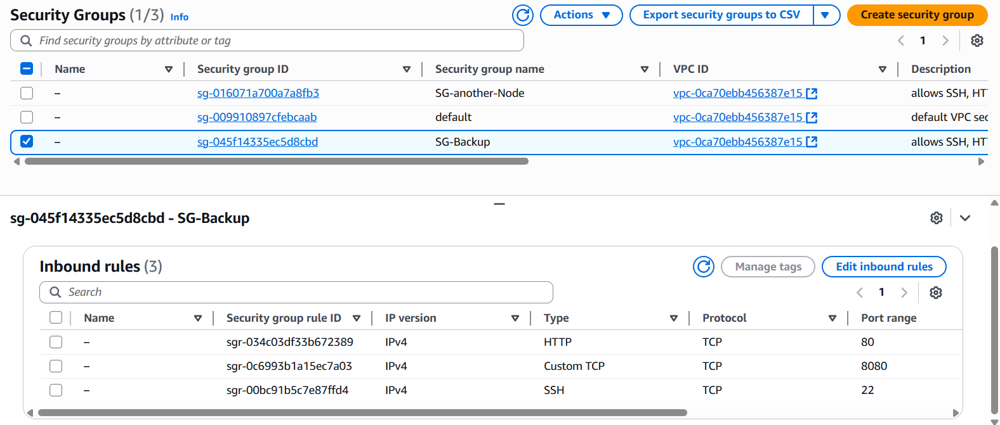
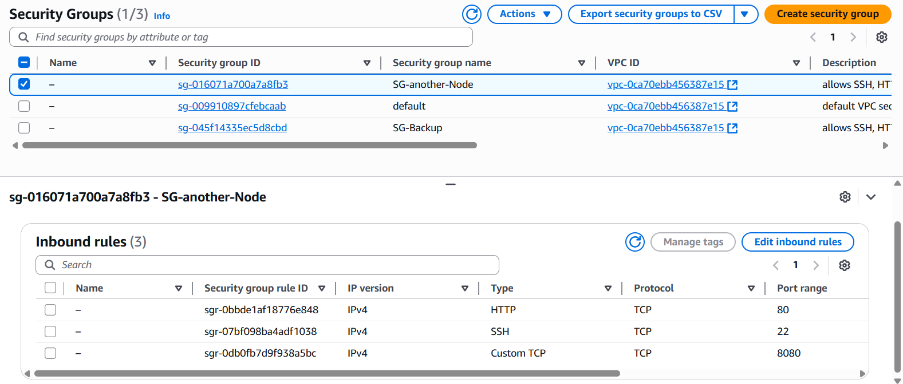
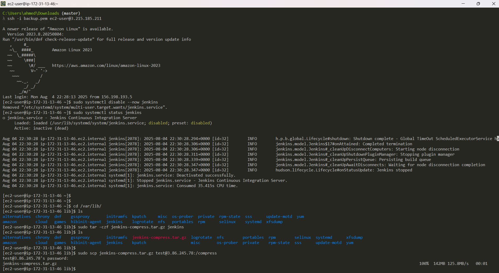
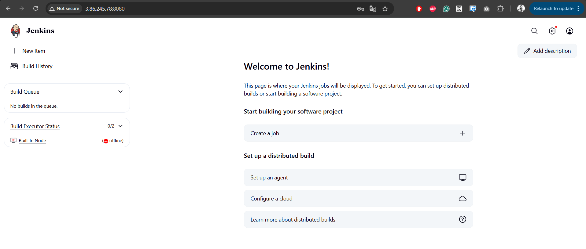
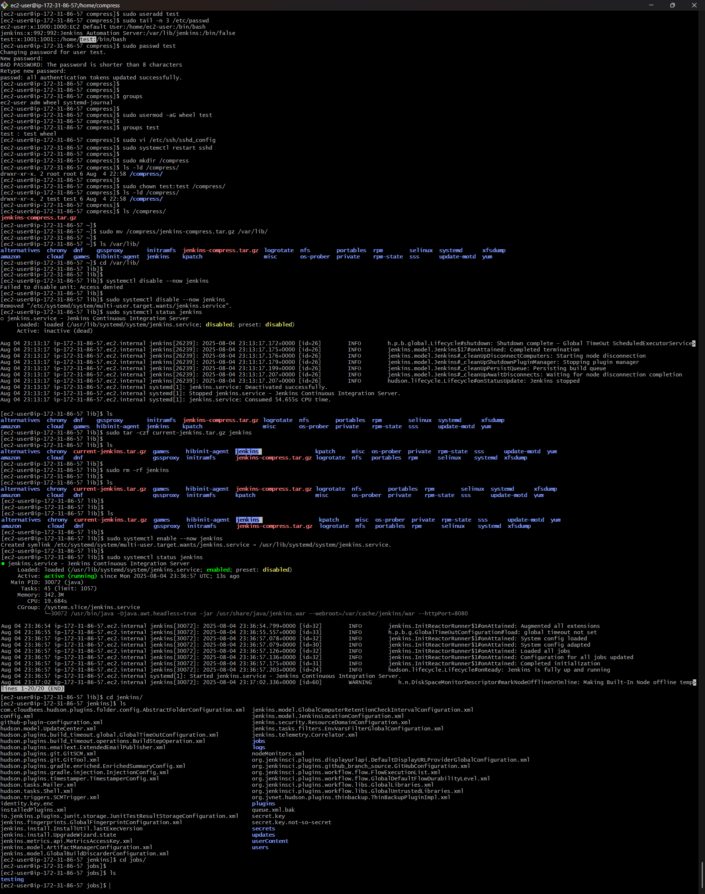
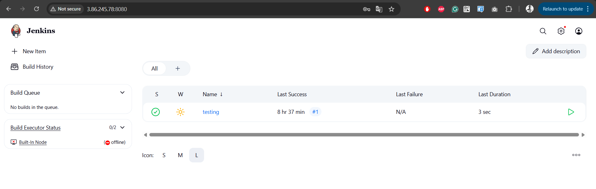
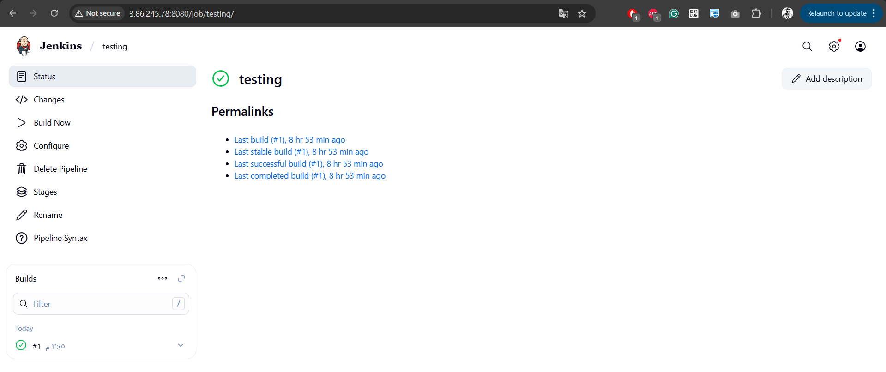

# 🚀 Jenkins Instance-to-Instance Migration Guide

Welcome! This professional guide will walk you step-by-step through migrating Jenkins from one instance to another, including best security practices and illustrated architecture diagrams. Let’s ensure your migration is smooth, secure, and well-documented! ✨

---

## 📚 Reference

- [Official Jenkins Installation Guide](https://www.jenkins.io/doc/tutorials/tutorial-for-installing-jenkins-on-AWS/#sidebar-content)

---

## 🖥️ Architecture Overview


### 🏗️ Instances



---

## 🔐 Security Groups

```bash
Allows: SSH, HTTP, 8080
```
- Make sure these ports are open for both your Jenkins and target instances.




---

## 🛠️ Jenkins Instance (Source Node)

### 🏁 Before Migration


### 📝 Migration Steps

```bash
1️⃣ Disable & Stop Jenkins
   sudo systemctl disable --now jenkins

2️⃣ Compress Jenkins Data
   cd /var/lib
   sudo tar -czf <Compress>.tar.gz jenkins

3️⃣ Copy Compressed Data to Another Node
   sudo scp <Compress>.tar.gz test@<IP>:/compress
   # Enter the password for the user
```



---

## 💻 Another Node Instance (Target Node)

### 🛑 Jenkins on Target Node Before Migration



### 📝 Migration Steps

```bash
1️⃣ Create a User
   sudo useradd test
   tail -n 3 /etc/passwd   # Verify user addition
   sudo passwd test
   sudo usermod -aG wheel test # Grant sudo privileges

2️⃣ Edit SSH Configuration (/etc/ssh/sshd_config)
   PermitRootLogin no
   PasswordAuthentication yes

3️⃣ Restart SSH Service
   sudo systemctl restart sshd 

4️⃣ Create Directory for Compressed Data
   sudo mkdir /compress
   sudo chown test:test /compress
   ls -ld /compress

5️⃣ Disable & Stop Jenkins
   sudo systemctl disable --now jenkins

6️⃣ Move Compressed Data to /var/lib
   sudo mv /compress/<Compress>.tar.gz /var/lib

7️⃣ (Optional) Backup Existing Jenkins Data
   sudo tar -czf <backup-name>.tar.gz jenkins
   sudo rm -rf jenkins

8️⃣ Uncompress Migrated Data
   sudo tar -xzf <Compress>.tar.gz

9️⃣ Enable & Start Jenkins
   sudo systemctl enable --now jenkins
   sudo systemctl status jenkins

🔟 Log in to Jenkins using previous credentials
```



---

### ✅ Jenkins on Target Node After Migration




---

## 🎯 Summary

- 🔄 Seamless Jenkins migration between nodes.
- 🔒 Security best practices followed.
- 📦 Data integrity ensured via compression and user management.
- 💡 For more details, check the [Jenkins official documentation](https://www.jenkins.io/doc/tutorials/tutorial-for-installing-jenkins-on-AWS/#sidebar-content).

---

> 🚨 **Tip:** Always backup your Jenkins data before starting any migration!