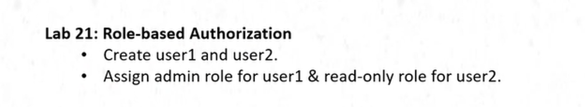
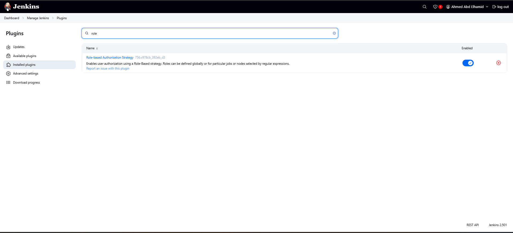
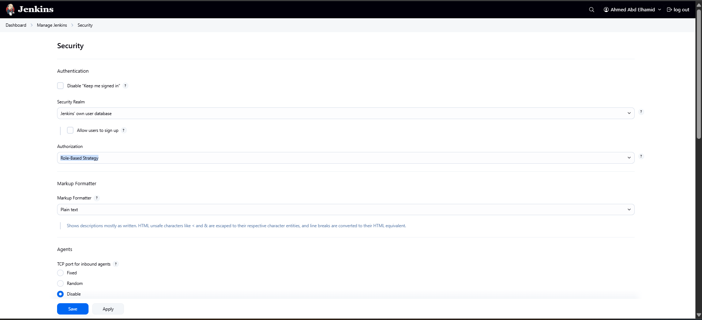
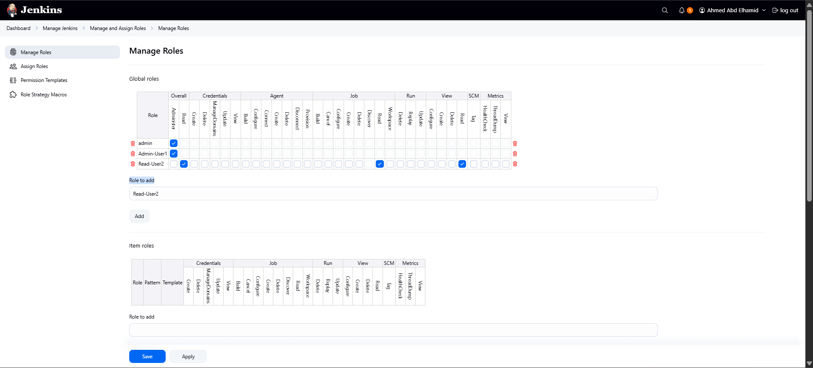
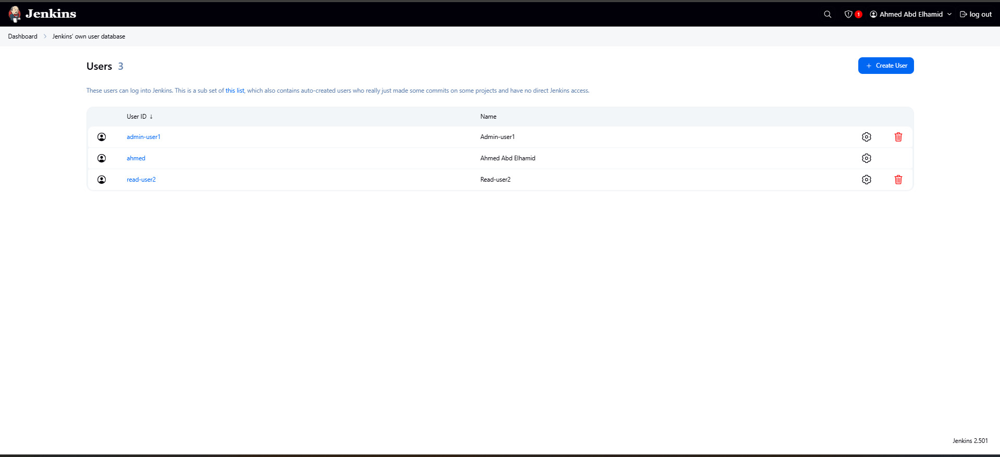
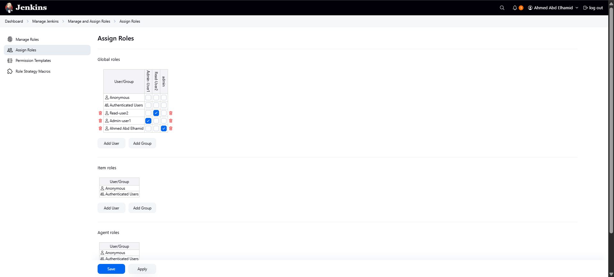
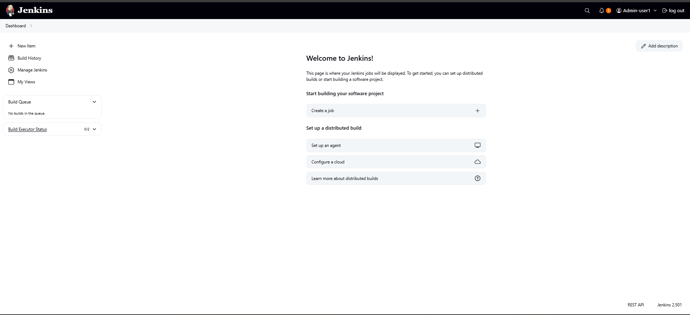

# 🛡️ Lab 2: Jenkins Role-Based Access Control Setup



Welcome to **Lab 2**! This guide will help you set up Jenkins with robust role-based authorization, user management, and access control.

---

## 🔌 Add Role Plugin

1. Go to **Manage Jenkins**  
2. Navigate to **Plugins**  
3. Search under **Available Plugins** for:  
   **Role-based Authorization Strategy**

```bash
# No command line needed – plugin installation via Jenkins UI!
```



---

## 🔒 Configure Role-Based Authorization Strategy

1. Go to **Manage Jenkins**  
2. Select **Security**  
3. Choose **Authorization (Role-Based Strategy)**  
4. Click **Save**

```bash
# No command line needed – configuration via Jenkins UI!
```



---

## 👔 Create Roles

1. Go to **Manage Jenkins**  
2. Select **Manage and Assign Roles**  
3. Under **Manage Roles**, type the name of the role  
4. Click **Add** and then **Save**

```bash
# No command line needed – role creation via Jenkins UI!
```



---

## 👥 Create 2 Users

1. Go to **Manage Jenkins**  
2. Navigate to **Users**  
3. Click **Create User** and fill in user details

```bash
# No command line needed – user creation via Jenkins UI!
```



---

## 🏷️ Assign Roles to Users

1. Go to **Manage Jenkins**  
2. Select **Manage and Assign Roles**  
3. Under **Assign Roles**, add the User-ID to the **Global Role**  
4. Click **OK** and then **Save**

```bash
# No command line needed – role assignment via Jenkins UI!
```



---

## 🔑 Change Password for Users

1. Go to **Manage Jenkins**  
2. Navigate to **Users**  
3. Choose your user  
4. Click **Configure your Password**  
5. Under **Security**, update your **Password**

---

## 🧪 Test Access by 2 Users

- **Admin User View:**
  
- **Read-Only User View:**
  

---

## 🎯 Summary

- 🔌 Installed & configured **Role-based Authorization Strategy** plugin
- 👥 Created users and defined roles
- 🏷️ Assigned roles to users for precise access control
- 🔑 Managed user passwords and tested access

> 📚 For more details, visit [Jenkins Official Documentation](https://www.jenkins.io/doc/).

---