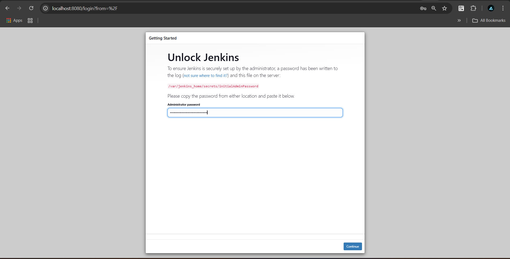

# 🚀 Lab 1: Jenkins Installation Guide


Welcome to **Lab 1**! This guide will walk you through installing and configuring Jenkins as both a service on Debian and as a container using Docker Desktop. 

---

## 🛠️ Install and Configure Jenkins as a Service (Debian)

### 1️⃣ Step 1: Install Java (OpenJDK 17)

```bash
sudo apt update -y
sudo apt install openjdk-17-jdk -y
java --version
```

---

### 2️⃣ Step 2: Install Jenkins

```bash
wget -q -O - https://pkg.jenkins.io/debian/jenkins.io.key | sudo apt-key add -
sudo sh -c 'echo deb http://pkg.jenkins.io/debian binary/ > /etc/apt/sources.list.d/jenkins.list'
sudo apt update
sudo apt install jenkins -y
```

#### 🔄 Enable & Start Jenkins

```bash
sudo service jenkins start
sudo service jenkins status
```

#### 🔑 Retrieve Admin Password

```bash
sudo cat /var/lib/jenkins/secrets/initialAdminPassword
```


---

## 🐳 Install and Configure Jenkins as a Container (Docker Desktop)

### 1️⃣ Step 1: Run Jenkins Container

```bash
# -v jenkins_home  ---->  Persistent Jenkins Data
# -v /var/run/docker.sock ---->  allows Jenkins to interact with Docker on the host machine
docker run -d --name jenkins -p 8080:8080 -p 50000:50000 \
  -v jenkins_home:/var/jenkins_home \
  -v /var/run/docker.sock:/var/run/docker.sock \
  jenkins/jenkins:lts-jdk17
```

#### 🔑 Retrieve Admin Password

```bash
docker exec jenkins cat /var/jenkins_home/secrets/initialAdminPassword
```




---

## 🎯 Summary

- 💻 **Jenkins as a Service**: Suitable for persistent server setups.
- 🐳 **Jenkins in a Container**: Ideal for quick setups and development environments.

> 📚 For more details, visit [Jenkins Official Documentation](https://www.jenkins.io/doc/).

---